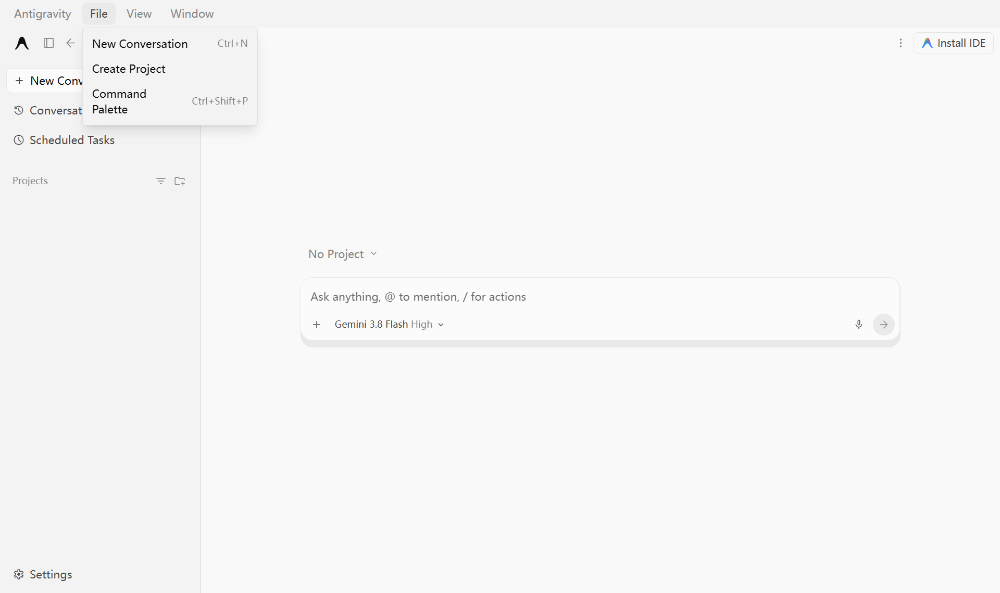
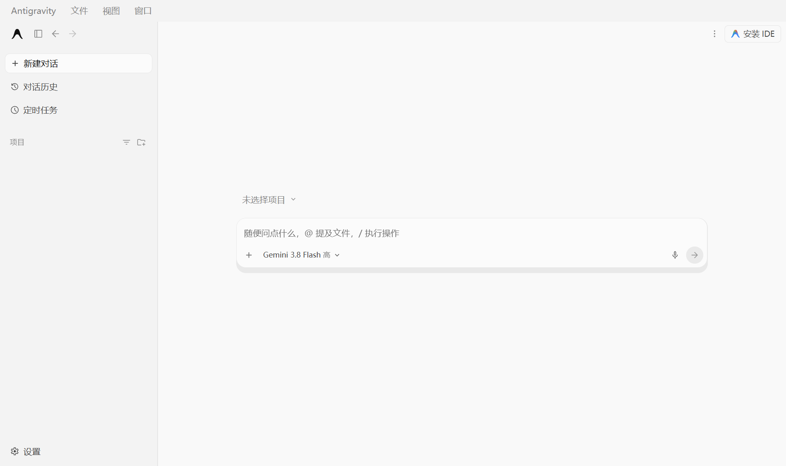
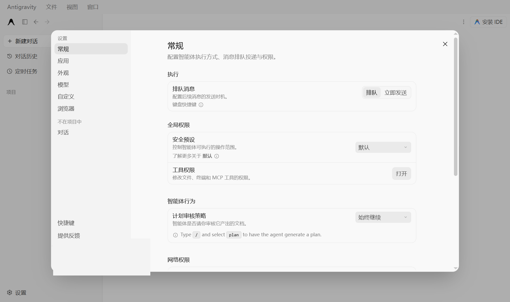

# Antigravity 中文汉化（运行时注入版）

给 **Google Antigravity 桌面客户端**做界面汉化 —— **不改任何安装文件**，随时可还原，官方更新也覆盖不掉。

> 适用于没有语言选项、也没有官方中文包的客户端。左侧栏、顶部菜单、设置全部分页、权限中心、模型与用量、快捷键页等均已汉化（当前词条 **274 条**）。





<sub>截图取自 Antigravity v2.17.0；示例截图里账号区域已打码。</sub>

---

## 先分清两个东西

| | **Antigravity**（本仓库针对的客户端） | **Antigravity IDE** |
|---|---|---|
| 界面技术 | Go 写的 `language_server.exe` 起本地服务 + Electron 外壳，界面是网页 | VS Code 工作台 |
| 有没有语言选项 | ❌ 没有，设置里翻遍了也没有 | ✅ 装中文语言包即可 |
| 怎么汉化 | 本仓库这套注入方案 | 命令面板 `Configure Display Language` |

**Antigravity 本体不是开源软件**（Google 专有，预览期免费）。开源的是补丁/工具 —— 包括这个仓库。

---

## 原理（三层）

```
① 连接    Antigravity 启动时自带 remote-debugging-port
          端口号写在 %APPDATA%\Antigravity\DevToolsActivePort
          → 用 CDP（Chrome DevTools Protocol）从外部接上页面，不碰安装目录

② 翻译    遍历 DOM 文本节点，折叠空白后「整串精确匹配」词条表 dict.json
          命中就改写 nodeValue；placeholder / title / aria-label 一并处理

③ 持续    MutationObserver 监听新增节点 + 每 3 秒兜底整页补扫
          异步弹出的新面板也会自动变中文
```

**安全性靠三件事保证**：

1. **整串精确匹配** —— 只有整段文本与词条完全一致才翻译，所以你输入的提示词、代码、文件名永远不会被误翻；
2. **保护区跳过** —— `输入框 / 编辑器 / 代码块 / 终端 / 已发送的用户消息` 整块不动；
3. **只改文本值，不动 DOM 结构** —— 不破坏前端框架的渲染树，最坏情况刷新页面即恢复。

---

## 快速开始

前置：装了 [Node.js](https://nodejs.org/) 18+，Antigravity 已安装（首次启动过一次）。

| 我想… | 怎么做 |
|---|---|
| **打开就是中文**（推荐日常用） | 双击 **`open-cn.bat`** —— 应用没开就帮你开，开了就注入。以后用它启动即可 |
| 应用已在运行，立刻变中文 | 双击 **`start-cn.bat`**（窗口别关，它负责持续翻译） |
| 每次开机自动中文 | 双击 **`install-autostart.bat`**（在启动文件夹里放个最小化运行的快捷方式）；卸载用 `uninstall-autostart.bat` |
| 还原英文 | 双击 **`restore.bat`**，或直接按 `Ctrl+R` 刷新窗口 / 重启应用 |

> `open-cn.bat` 和 `start-cn.bat` 的区别：前者多带一个 `--launch`，应用没运行时会先把它拉起来。想换个地方放也可以，整个文件夹拷走就行。

---

## 覆盖范围

**已覆盖**

- 顶部菜单：文件 / 视图 / 窗口、新建对话、命令面板、检查更新
- 左侧栏：对话历史、定时任务、项目、安装 IDE、子智能体、已更改文件、后台任务、终端
- 设置全部分页：常规 / 应用 / 外观 / 模型 / 自定义 / 浏览器 / 不在项目中 / 对话 / 快捷键 / 提供反馈 / 账号
- 权限中心：执行、排队消息、全局权限、安全预设（含 完全授权 / 极速模式 / 自定义 及其说明）、工具权限、计划审核策略、网络权限、沙箱外命令、浏览器操作规则
- 模型与用量、通知、远程控制、MCP 服务器、插件目录、反馈表单、设置迁移提示
- 动态文案（版本号、文件数、限额百分比…）用正则规则层处理

**不覆盖（有意为之）**

| 项 | 说明 |
|---|---|
| 智能体回复正文 | 那是模型输出，词条管不着。想让它说中文，在设置 → 规则 / `AGENTS.md` 里写「始终用简体中文回复」 |
| 代码块 / 编辑器 / 终端内容 | 故意不翻 |
| Electron 原生层 | 系统托盘菜单、原生弹窗、更新提示、安装向导 —— 硬编码在 `app.asar` 里，注入够不着 |
| 被内联 `<code>` 拆散的长句 | 按片段翻译，语序按英文，读起来略生硬；已尽量补齐常见几条 |
| 插件/技能的纯 ID | 如 `chrome-devtools`，没有展示名，保留原文 |

---

## 自己加词条

`dict.json` 就是一张 `"英文原文": "中文"` 的对照表，改完存盘即可，**不用动代码**：

```bash
# 1. 打开应用，进到你想汉化的那个界面
# 2. 采集「还没被翻译」的英文文案（自动过滤掉词典里已有的）
node cdp.js run harvest.js > 未翻译.txt

# 3. 把要翻的补进 dict.json  → 4. 重新注入，立即生效（不用重启应用）
start-cn.bat --once
```

带变量的文案（如 `Version 2.17.0`）在 `inject.js` 顶部的 `RULES` 里加一条正则即可。

---

## 常见问题

**Q：会被官方更新覆盖吗？**
不会。全程没有修改安装目录，连 `app.asar` 的字节数都没变。更新后照常只是运行一次注入。

**Q：会不会把我的提问也翻译了？**
不会。整串精确匹配 + 保护区跳过，输入区、编辑器、已发送消息、代码块都不碰。

**Q：为什么不做成"改 app.asar 注入 preload"那种落盘方案？**
那种方案能覆盖托盘和原生弹窗，但代价是：① 每次更新被覆盖、要重打补丁；② 等于把机器交给一段陌生代码。本仓库选择运行时不落盘，可控、可还原。

**Q：改完词条没生效？**
先在页面里注入的引擎会热更新（日志显示 `hot-updated:NNN`）。如果显示 `stale`，脚本会自动刷新页面重注入。

**Q：连不上调试端口？**
先打开 Antigravity 再运行脚本；或用 `open-cn.bat`（会自动拉起应用）。

---

## 文件清单

| 文件 | 作用 |
|---|---|
| `open-cn.bat` | 拉起应用 + 注入（日常入口） |
| `start-cn.bat` | 只注入（应用需已在运行） |
| `restore.bat` | 还原英文 |
| `install-autostart.bat` / `uninstall-autostart.bat` | 开机自启的安装 / 卸载 |
| `inject.js` | 连接 CDP、注入引擎、守护新窗口；支持 `--once` / `--launch` / `--restore` / `--port` |
| `engine.js` | 页面内运行的汉化引擎 |
| `dict.json` | 词条表（要加词就改这个） |
| `cdp.js` | 通用 CDP 小工具：`list` / `text` / `eval` / `run` / `shot` |
| `harvest.js` | 采集当前界面未汉化的文案 |

---

## 同类项目

社区里还有几个针对 Antigravity 的汉化补丁，思路相似（ASAR 注入 preload 或 CDP 热挂载）：

- `liominsb/Antigravity-Chinese-Localization`
- `yiheng8023/antigravity-chinese`
- `ATopos-svg/antigravity-chinese-community-pack`
- `Silas-02/antigravity-desktop-cn`

它们能覆盖到托盘/原生弹窗，但会改写 `app.asar`，使用前请自行阅读源码。

---

## English

Runtime localization for the **Google Antigravity desktop client** — Chinese UI without touching a single installed file.

Antigravity ships no language option and no official language pack, and it is **not open source** (proprietary, free during preview). This tool attaches to the app's built-in DevTools port over CDP, injects a small dictionary-driven DOM translator, and keeps translating newly rendered nodes via `MutationObserver`.

- **No file is modified** — `app.asar` is untouched; press `Ctrl+R` to go back to English instantly.
- **Safe by design** — exact whole-string matching plus protected regions (inputs, editors, code blocks, sent user messages), so your own text is never rewritten.
- **Extensible** — add entries to `dict.json` and re-inject; no code changes needed.

**Usage**: install Node.js 18+, then double-click `open-cn.bat` (launches or attaches to Antigravity and localizes it). `restore.bat` reverts.

---

## License

MIT — 与 Google 无任何隶属关系，仅为第三方界面汉化工具。使用风险自负。
